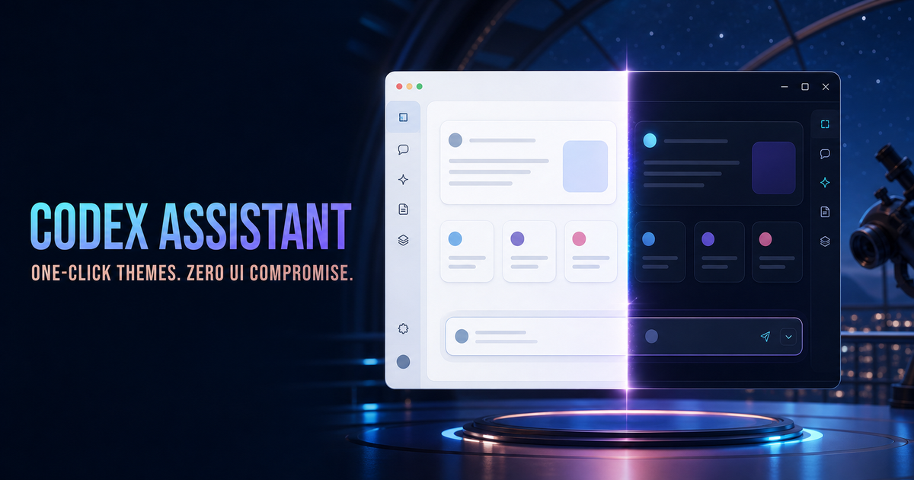

# Codex Assistant

> Windows 官方 ChatGPT/Codex 的只读子代理观察器与安全一键换肤工具。<br>
> A read-only subagent observer and safe one-click theme companion for the official Windows ChatGPT/Codex app.



[官网](https://codex-assistant-windows.dzass2.chatgpt.site) ·
[下载 v0.12.0](https://github.com/dzass3/codex-assistant/releases/tag/v0.12.0) ·
[问题反馈](https://github.com/dzass3/codex-assistant/issues)

## 中文

### 功能

- 只读显示根任务和子代理的层级、运行状态、实际模型、推理强度与模型漂移。
- 一键应用 16 套随安装包分发、已经完成人工权利核验的主题。
- 导入你有权使用的 PNG、JPEG 或 WebP 图片；素材只保存在当前设备。
- 应用前检测 Windows、处理器架构、Microsoft Store 官方 Codex、窗口数量、版本适配器与主题控制会话。
- 主题只装饰经过验证的视觉层，不修改 Microsoft Store 包、`app.asar`、WindowsApps 文件、官方数据库或代码签名。
- 失败时关闭失败并恢复一致的官方外观；不会把部分应用误报为成功。

Smart Routing 不属于当前产品。Codex Assistant 不创建、控制、改派或自动重启子代理；实时代理页只读取本机已有的安全元数据。

### 支持环境

- Windows 10/11
- x64 或 ARM64
- Microsoft Store 安装的官方 ChatGPT/Codex 桌面应用

其他打包方式、多个同时运行的官方窗口或未知版本会被预检拒绝，并显示可执行的处理建议。

### 安装

在 [v0.12.0 Release](https://github.com/dzass3/codex-assistant/releases/tag/v0.12.0) 中按设备选择：

| 架构  | 推荐安装包                               | MSI                                      |
| ----- | ---------------------------------------- | ---------------------------------------- |
| x64   | `Codex Assistant_0.12.0_x64-setup.exe`   | `Codex Assistant_0.12.0_x64_en-US.msi`   |
| ARM64 | `Codex Assistant_0.12.0_arm64-setup.exe` | `Codex Assistant_0.12.0_arm64_en-US.msi` |

> **未签名提示：** 0.12.0 安装包尚未购买代码签名证书，Windows 可能显示 SmartScreen 或“未知发布者”提示。请只从本仓库 Release 或官网进入下载，并使用 Release 中的 `SHA256SUMS.txt` 校验文件。

PowerShell 校验示例：

```powershell
Get-FileHash -Algorithm SHA256 -LiteralPath '.\Codex Assistant_0.12.0_x64-setup.exe'
```

### 应用与恢复主题

1. 从官方入口打开 ChatGPT/Codex，并确保只运行一个官方窗口。
2. 打开 Codex Assistant，在“一键换肤”页通过本机环境检测。
3. 选择主题并点击“应用主题”；需要重启官方应用时，Codex Assistant 会先说明影响并等待确认。
4. 点击“恢复官方外观”可撤销当前会话中的主题。

主题选择会保留，但主题应用绑定当前经过验证的官方会话。完全关闭并从官方入口重新打开 ChatGPT/Codex 后，需要回到 Codex Assistant 再点击一次“应用主题”。应用不会创建替代入口、启动项、计划任务、系统托盘常驻或自动重启官方应用。

### 本机图片导入

导入器会检查真实文件签名、MIME、像素尺寸、编码大小、SHA-256 和目录边界。相同图片重复导入是幂等的。本机素材只写入 Codex Assistant 自有状态目录，不会上传、进入源码、网站或公开安装包。

### 隐私与安全边界

- 监控只读取本机状态数据库和 rollout 的白名单元数据。
- 不读取或展示提示词、回复、推理、工具参数/输出、Cookie、令牌或完整私人路径。
- CDP 只允许随机回环端口、当前 Windows 用户和经过校验的官方进程。
- 背景层不接收鼠标事件；主题应用后会验证主内容、侧栏和输入区仍然可见、可点击。
- 登录、账户、支付、授权、权限、恢复与未知页面保持官方外观。
- 启动迁移只处理 Codex Assistant 自有状态，不读取、改写或清理用户的 `.codex` 配置、代理、MCP 或全局 Skills。

更多设计与来源边界见 [THIRD_PARTY_NOTICES.md](THIRD_PARTY_NOTICES.md)。

### 故障排查

- **应用后没有皮肤：** 保持一个官方窗口，点击“刷新状态”，按预检提示建立主题控制会话后再次应用。
- **重开后主题消失：** 这是当前安全模型的预期行为；选择已保存，请手动再次点击“应用主题”。
- **页面显示不兼容：** 先恢复官方外观并在 Issues 提交官方 Codex 版本、Codex Assistant 版本和脱敏错误码。
- **安装警告：** 对照 Release 的 SHA-256；不要从第三方网盘或重新打包站点安装。

### 源码构建

需要 Node.js 22+、Rust stable、WebView2 和带 Windows C++ 工具链的 Visual Studio Build Tools。

```powershell
npm ci
npm run check
npm run tauri build -- --bundles nsis,msi
```

网站位于 `website/`：

```powershell
cd website
npm ci
npm test
```

## English

### What it does

- Observes root tasks and native subagents using read-only, allow-listed local metadata.
- Ships 16 rights-reviewed themes and supports local PNG, JPEG, and WebP imports.
- Checks Windows, CPU architecture, the official Microsoft Store Codex package, window count, version adapter, and the local theme-control session before applying a theme.
- Decorates verified visual surfaces without patching the Store package, `app.asar`, WindowsApps files, official databases, or code signatures.
- Fails closed and restores a consistent official appearance when compatibility checks do not pass.

Smart Routing is not part of this product. The observer does not create, control, reroute, or restart subagents.

### Requirements

- Windows 10 or Windows 11
- x64 or ARM64
- The official Microsoft Store ChatGPT/Codex desktop app

### Install and verify

Download the matching EXE or MSI from the [v0.12.0 release](https://github.com/dzass3/codex-assistant/releases/tag/v0.12.0).

> **Unsigned build:** version 0.12.0 is not code-signed. Windows may show SmartScreen or “Unknown publisher.” Download only through this repository or the official project website, then compare the SHA-256 value with `SHA256SUMS.txt`.

### Apply or restore a theme

1. Start ChatGPT/Codex from its official entry and keep exactly one official window open.
2. Open Codex Assistant and pass the local preflight checks.
3. Pick a theme and click **Apply theme**. If a restart is needed, the app explains the impact and waits for explicit confirmation.
4. Use **Restore official appearance** to remove the current session theme.

The selection persists, but application is bound to the currently verified official session. After fully closing and reopening ChatGPT/Codex, click **Apply theme** again. Codex Assistant does not install an alternate launcher, startup task, scheduled task, tray resident, or automatic restart service.

### Privacy and safety

- No prompts, responses, chain-of-thought, tool payloads, cookies, tokens, or full private paths are collected.
- Local image imports stay on the device.
- Theme backgrounds never receive pointer events, and post-apply checks protect navigation, content, icons, controls, and the composer.
- Login, account, billing, authorization, permission, recovery, and unknown pages retain the official appearance.

### Development

```powershell
npm ci
npm run check
npm run tauri build -- --bundles nsis,msi
```

The public website is in `website/` and can be verified with `npm test`.

## Attribution and license

Codex Assistant retains the history and MIT attribution of
[PixelPaw-Labs/codex-trace](https://github.com/PixelPaw-Labs/codex-trace).
The theme workflow was reviewed against
[Fei-Away/Codex-Dream-Skin](https://github.com/Fei-Away/Codex-Dream-Skin)
as a design reference; its excluded media is not redistributed here.

See [LICENSE](LICENSE), [THIRD_PARTY_NOTICES.md](THIRD_PARTY_NOTICES.md), and the rights metadata in `shared/theme-catalog.json`.
