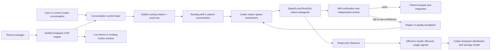

# Codex Assistant — Product Iteration Design

- Status: Draft for written review
- Date: 2026-07-18
- Replaces the user-facing product scope of `2026-07-18-codex-agent-model-monitor-design.md`; the original monitor architecture remains the Observer subsystem.

## Summary

Codex Agent Monitor becomes **Codex Assistant**, a Windows companion with three clearly separated capabilities:

1. **Observer** — preserves the current read-only, metadata-only native-agent monitor.
2. **Smart routing** — installs and activates quality-first native custom-agent profiles so the current Codex conversation can repeatedly route suitable work to Spark, Luna, Terra, or Sol without opening another execution window.
3. **Theme manager** — applies audited, rights-cleared themes to the existing Codex window through a hardened local CDP engine, with one-click switching and one-click restoration.

The central product promise is quality first. Lower-cost and faster models are selected only inside verified capability and risk boundaries. Implemented work is not accepted until it passes self-verification and independent review. Unsupported models, unavailable UI hooks, missing usage data, and uncertain asset rights are shown honestly rather than simulated.

## Confirmed decisions

- Product display name becomes **Codex Assistant**.
- Smart routing is opt-in per visible root conversation and remains active for later turns until disabled.
- Routing is opportunistic; enabling it does not force every message through a subagent.
- Routed work uses only real Codex native subagents shown in the current conversation's native subagent panel.
- Detached `codex exec` processes, hidden conversations, imitation subagent cards, and patched official Codex binaries are prohibited.
- Model order is Spark → Luna → Terra → Sol, constrained by task complexity, risk, capability, quality evidence, and native capability preflight.
- Failed validation causes repair/re-review or automatic escalation; saving time or quota never bypasses a quality gate.
- Savings use actual observed execution data plus a quality-matched historical counterfactual baseline. They are estimates unless a comparable controlled run exists.
- The conversation control is injected into the current Codex composer and binds to that visible root thread.
- The theme engine may restart Codex once during installation. Later theme switching remains in the existing window.
- Bundled people, celebrity, anime, IP, and screenshot assets require verifiable commercial redistribution rights. Unverified assets are local-import only.
- The open-source Dream Skin engine may be reused under MIT terms with attribution, but excluded or unclear-rights assets are not redistributed.

## Goals

- Reduce Sol/Terra consumption and elapsed time on suitable supporting work without reducing acceptance quality.
- Let a Terra native child delegate one bounded task to an eligible Luna or Spark child when that is a net benefit.
- Keep all routed agents in the current root thread and native subagent panel.
- Explain every route, escalation, quality outcome, and savings estimate.
- Rename and upgrade the installed application without creating a duplicate installation or losing existing settings.
- Provide safe one-click theme selection, local image import, live preview, persistence, compatibility fallback, and official appearance restoration.
- Preserve the existing observer's metadata-only privacy guarantee.
- Publish the updated installer and product documentation on the existing public Sites deployment after local release validation.

## Non-goals

- Bypassing account entitlements, host model allowlists, native spawn restrictions, or official quota enforcement.
- Guaranteeing that Luna is a native child model merely because it appears in the root model picker.
- Reporting exact remaining ChatGPT quota when the platform does not expose it.
- Capturing prompts, responses, reasoning, tool arguments, tool outputs, authentication material, or full project paths for analytics.
- Running an external model executor and presenting it as a native subagent.
- Modifying `WindowsApps`, `app.asar`, official application binaries, code signatures, API keys, or model-provider configuration.
- Loading arbitrary JavaScript or unrestricted CSS from a theme pack.
- Redistributing assets without a verified commercial redistribution basis.

## Product architecture

The existing React/Tauri application remains the primary companion. New backend modules are isolated from the observer:

- `observer`: current read-only SQLite and rollout reconciliation.
- `codex_config`: transactional installation, backup, migration, and restoration of custom-agent and MCP configuration.
- `capability_preflight`: verifies native model/profile availability using observed effective-model metadata.
- `routing_state`: stores opt-in state, opaque route keys, reason codes, quality outcomes, and aggregate metrics without task content.
- `routing_mcp`: a bundled local sidecar that exposes metadata-only policy and outcome tools to the routing skill.
- `metrics`: builds quality-matched baselines and confidence-labelled savings estimates.
- `theme_engine`: manages verified Codex launch, random loopback CDP, injection lifecycle, compatibility checks, and restore.
- `theme_catalog`: validates declarative theme packs, local imports, rights manifests, and signed catalog metadata.

The frontend gains four product areas: **Live Agents**, **Smart Routing**, **Savings**, and **Themes**. The current agent tree becomes Live Agents rather than being removed.

## Rename and upgrade migration

The first Codex Assistant release is planned as `0.5.0` while the new capabilities remain compatibility-sensitive.

- Change product name, window title, UI text, Start menu label, installer display name, README, public site, and release artifact names to Codex Assistant.
- Preserve Tauri identifier `com.codexagentmonitor.desktop`, installer upgrade identity, and existing data directory so the upgrade replaces version `0.4.0` instead of installing beside it.
- Migrate old shortcuts to the new display name and remove only shortcuts proven to belong to the previous installation.
- Preserve monitor settings and historical metadata. Introduce schema migrations for routing, metrics, and themes.
- Keep an explicit rollback path to the last working version and configuration backup.
- Refer to the original feature as the Observer or Live Agents module; do not keep the old product name as a second brand.

## Native smart routing

### One-time installation

Codex Assistant installs versioned personal custom-agent profiles under `~/.codex/agents/`, a versioned routing skill under `~/.codex/skills/`, and a local metadata-only MCP sidecar entry. It edits `~/.codex/config.toml` transactionally:

- create a timestamped, permission-preserving backup;
- parse and merge TOML rather than replacing the file;
- set `agents.max_depth = 2` only after explicit enablement;
- preserve an existing higher `agents.max_depth` and unrelated settings;
- preserve `agents.max_threads` exactly when present and leave the host default unchanged when absent; the router independently allows at most three concurrently running routed children per root;
- write to a temporary file, validate the full configuration, atomically replace it, and restore the backup on any failure.

Codex is restarted once after installation because custom-agent and config changes load at session startup. The installer never promises that an already-running pre-installation turn will gain new profiles.

### Native capability preflight

After restart, Codex Assistant inserts a visible, auditable preflight command into the current conversation. The host creates minimal native test children for configured profiles. The observer verifies:

- a real child thread exists under the current root;
- the child appears through native agent metadata;
- requested and effective model agree;
- the child reaches a terminal or idle state without model-availability failure;
- no detached process or second root conversation was created.

A profile becomes eligible only after these checks. Direct-child and nested-child eligibility are recorded separately: a successful root → Luna run does not prove Terra → Luna works until the depth-two preflight also succeeds. Spark is documented as a lightweight Codex model, but still requires runtime preflight. Luna appears in the user's root model picker but is treated as **unverified** until the native child preflight succeeds. A model drift from Luna/Spark to Terra does not count as support.

Preflight results are scoped to Codex version, profile version, requested model, and direct-versus-nested route. A Codex update or native model-availability/authentication error invalidates the affected result and schedules another preflight. Credentials and account identity are never read.

### Conversation activation

The verified CDP control layer adds a clearly branded **Codex Assistant · Smart Routing** chip to the current composer. It reads only the visible task route identity required to bind state; it does not copy or persist editor text.

When enabled:

- Codex Assistant creates an opaque per-root route key in local state.
- The composer displays the enabled state and serializes a small, user-visible routing directive and route key with submitted turns while the mode remains on. Repeating the marker makes the state robust to context compaction.
- The directive invokes the installed routing skill. It does not contain task content or hidden instructions.
- The routing skill queries the local sidecar for the eligible profiles and policy version, classifies proposed subtasks, and calls Codex's native spawn mechanism.
- The app observes the resulting native children and displays their actual effective model.

When disabled, no new routed children are created. Already-running children are allowed to finish unless the user separately asks Codex to stop them. Route keys remain attached to the root until disabled; cleanup removes them only after the observer confirms that the root no longer exists for 30 days.

If the control layer cannot identify the visible root unambiguously, the button disables itself and explains the compatibility issue rather than enabling a workspace-wide policy.

### Routing tiers

| Tier | Default model profile | Work boundary | Examples |
|---|---|---|---|
| 1 | Spark | Fully specified, mechanical, low-risk, narrow context | Exact lookup, deterministic transformation, complete-spec single-file change, focused test addition |
| 2 | Luna | Clear, bounded, low-risk implementation or analysis | One-to-two-file implementation, routine refactor, focused test repair, documentation synthesis |
| 3 | Terra | Cross-file integration or meaningful judgment | Multi-file change, backend integration, non-trivial debugging, broad read-heavy review |
| 4 | Sol | Ambiguous, architectural, security-sensitive, destructive, or final integrative judgment | Architecture, migrations, security review, unclear failures, final whole-task acceptance |

Routing is a constrained optimization:

1. Reject profiles that failed native preflight or lack required tools/modalities.
2. Apply hard risk constraints; destructive, credential, security, deployment, and architecture decisions remain at the highest required tier.
3. Estimate coordination overhead. Keep trivial work in the parent when spawning is unlikely to produce a net benefit.
4. Choose the least costly eligible tier expected to meet quality.
5. Record reason codes, not prompt text: complexity band, file-count band, risk band, required capability, selected profile, and confidence.

The user may override a turn with `do not delegate`, `use Sol`, or an explicit eligible profile. Overrides cannot bypass safety or quality gates.

### Native nesting and fan-out control

`agents.max_depth = 2` allows a depth-one Terra agent to delegate one tightly bounded Spark/Luna child. The routing skill imposes stricter rules than the global host limit:

- no child may create broad or open-ended fan-out;
- a depth-one child may delegate at most one independent bounded task at a time;
- at most three routed children may be active under one root;
- at most two automatic model escalations are allowed for one subtask before Sol/root intervention;
- reviewers do not recursively delegate unless the review itself is reclassified above their capability;
- parallel implementers must not edit overlapping files; otherwise tasks run sequentially or in isolated worktrees.

These limits prevent the button from increasing quota usage through recursive agent multiplication.

### Quality protocol

The orchestration follows the user-selected `subagent-driven-development` principles:

1. Parent creates a narrow task brief with exact scope, constraints, output contract, and validation evidence required.
2. A fresh native implementer performs the task, runs proportional tests, self-reviews, and reports status.
3. A separate native reviewer evaluates specification compliance and code quality from bounded artifacts.
4. Critical or important findings return to a fixer and then to re-review.
5. Low confidence, capability mismatch, repeated repair, or scope expansion triggers quality escalation.
6. Sol/root performs architecture decisions, risky operations, and final whole-task integration review.

Default review floors:

- Spark output: Luna reviewer when eligible, otherwise Terra.
- Luna output: Terra reviewer.
- Terra output: Sol/root reviewer for consequential changes; a suitable Terra reviewer may handle small read-only reviews.
- Sol output: independent Sol review when the risk justifies another agent; otherwise explicit parent self-verification and user-visible evidence.

Review work is scaled to risk and diff size. A trivial deterministic task does not receive a wasteful whole-repository review, but no code-changing route can declare success without verification evidence.

### Runtime status in Codex

The injected chip shows only metadata states:

- Off
- Enabled
- Classifying
- `Spark/Luna/Terra/Sol · implementing`
- `model → higher model · quality escalation`
- Reviewing
- Completed
- Degraded or unavailable

Expanding it shows actual effective models, reason codes, elapsed time, quality-gate state, and estimated savings. It does not display prompts, reasoning, tool content, or patches. The native subagent panel remains the authoritative place to inspect native agent details.

## Savings and quality comparison

### Actual observations

For each routed task, the product stores only:

- root and child pseudonymous local identifiers;
- effective model and reasoning effort;
- lifecycle timestamps and duration;
- task complexity/risk bands and route reason codes;
- quality-gate outcome, retry count, escalation count, and terminal status;
- token/usage counters only when Codex exposes them as safe metadata.

Failed attempts, reviews, repairs, and escalations are included in actual consumption. The app never optimizes a chart by dropping unsuccessful runs.

### Counterfactual baseline

The disabled-mode baseline groups comparable, quality-matched historical work by complexity band, risk band, project category, required capability, and successful quality outcome. It uses robust medians and dispersion rather than a single best run.

- Fewer than 5 comparable samples: `Insufficient evidence`; no precise percentage.
- 5–19 samples: low confidence and a wide interval.
- 20–49 samples: medium confidence.
- 50 or more samples: high confidence, subject to model/version recency weighting.

The comparison presents:

- actual elapsed time and known usage;
- expected disabled-mode interval;
- estimated time saved;
- estimated Sol/Terra-equivalent consumption avoided;
- quality-gate pass rate and escalation cost;
- sample size, confidence, and data limitations.

The application never claims exact remaining account quota. It does not duplicate a production task merely to obtain an A/B measurement. Model or Codex-version changes decay older baseline samples.

## Theme manager

### Open-source basis

The implementation may vendor or port an audited subset of [Fei-Away/Codex-Dream-Skin](https://github.com/Fei-Away/Codex-Dream-Skin) pinned initially at commit `3af1d6d62f3a0388cc640d2f497ac3100998938e`. The repository software is MIT-licensed; its copyright and license text must be added to `THIRD_PARTY_NOTICES.md` and distributed with the application.

The port must not include repository assets excluded by its NOTICE, including the Arina Hashimoto files or documentation preview screenshots. An upstream update is never consumed automatically: update the pinned commit, review its diff, rerun security/compatibility tests, and update notices.

### Engine lifecycle

- Discover and verify the official Microsoft Store Codex package and executable identity dynamically.
- Require Codex to be idle before the one-time themed-session restart; do not kill active routed agents.
- Launch the same official Codex application with a random available loopback-only CDP port.
- Verify browser identity, process ownership, package identity, and expected Codex version before injection.
- Apply a compatibility probe before inserting controls or styles.
- Keep the injector local and terminate it and its child processes on Restore. Because the CDP endpoint belongs to the Codex process, closing that endpoint may restart the same official Codex app after routed agents become idle; it must never leave a second Codex instance running.
- Never persistently change PowerShell execution policy, firewall rules, API configuration, or official application files.

The reference engine's behavior is treated as design input, not blindly executed downloaded code. Security-sensitive process management moves into the Rust backend where practical; any retained injector JavaScript is bundled, hashed, versioned, and contains no remote code loading.

### Declarative theme packs

A theme pack contains only validated declarative data:

- `theme.json` with schema and engine compatibility versions;
- background and optional overlay images;
- predefined palette, opacity, blur, focus, contrast, motion, and safe-area parameters;
- preview image created from assets the pack is licensed to distribute;
- `rights.json` with source, author/rightsholder, license or authorization category, commercial redistribution scope, attribution, asset hashes, and review status.

Remote or imported packs may not contain JavaScript, executables, PowerShell, arbitrary HTML, or unrestricted CSS. Visual effects are selected from engine-owned implementations.

Image imports reject files over 16 MB, dimensions over 16,384 pixels, more than 50 megapixels, mismatched content types, malformed decodes, reparse points, and paths outside the selected file. Imported assets are copied into an app-owned directory with safe generated names and are never uploaded by default.

### Theme library and rights gate

The initial public release includes:

- original abstract themes owned by the project;
- character/person/anime/IP themes only when a verifiable commercial redistribution authorization covers every asset and the intended distribution;
- user-local imports that remain private to the machine.

Each bundled pack must pass an auditable release checklist. A protected character name, celebrity likeness, franchise mark, repository screenshot, or third-party artwork without sufficient authorization fails closed. The product can describe why a pack is unavailable without exposing private authorization documents.

The public Sites project may host a signed static catalog and rights summaries. Theme packs are accepted only when the catalog signature, hashes, schema, engine range, and rights-gate status verify. Offline bundled themes and local imports continue to work when the catalog is unavailable.

### Theme user experience

The Codex composer receives a clearly branded theme button. It opens an in-window picker with preview, Apply, Save, and Restore actions. Applying a compatible theme updates the existing window live. Restore removes injected presentation immediately and, when necessary to close CDP, waits for native agents to become idle before restarting the same Codex application. Detailed theme management in the companion app includes search, attribution, rights status, local import, deletion, and export of user-owned themes.

Reduced-motion, readable contrast, keyboard focus, text scaling, and official appearance fallback are mandatory. A theme may decorate the UI but must not hide approvals, model status, permission controls, security warnings, or active-agent indicators.

## Privacy and security boundaries

The Observer remains governed by ADR 0001. It opens Codex data sources read-only and retains only whitelisted agent metadata.

The new control path is separate and explicit:

- transactional writes are limited to Codex Assistant-owned state, versioned custom-agent/skill files, the MCP entry, and narrowly merged agent config;
- every config change has a backup, exact diff, validation, and Restore action;
- the conversation control layer reads the visible route identity but does not retain editor contents;
- routing markers are visible and contain policy/version data plus an opaque route key, never user task content or credentials;
- the MCP sidecar accepts only local stdio from Codex, validates route keys, and exposes metadata-only schemas;
- local state is protected with current-user ACLs and contains no auth tokens, prompts, responses, reasoning, commands, or patches;
- diagnostics use sanitized categories and counters;
- CDP binds only to loopback, uses a random ephemeral port, and is presented as a same-user local-process risk while active;
- no analytics or remote telemetry is added.

Theme catalog networking is opt-in or limited to signed public metadata and assets. It is isolated from Codex authentication and routing state.

## Error handling and recovery

- **Configuration parse/write failure:** do not restart Codex; restore the byte-identical backup and show the failed validation.
- **Custom profile rejected:** mark it unavailable, retain verified tiers, and show the native error category.
- **Requested/effective model drift:** do not count the requested profile as eligible; route to the next verified tier.
- **No eligible lower-cost tier:** keep work in Terra/Sol and show that quality constraints prevented savings.
- **Routing sidecar unavailable:** disable automated routing metadata and fall back to the explicit skill-only path; never start an external executor.
- **Ambiguous active root:** disable the injected toggle for that view rather than activating another conversation.
- **Agent quality failure:** include its cost, repair/review, and escalate according to the bounded policy.
- **Codex update or DOM probe failure:** keep official appearance, disable injected controls, and leave the read-only Observer available.
- **Theme apply failure:** remove partial injected nodes/styles and restore the last known good or official appearance.
- **App/injector crash:** official files remain unchanged; next launch detects stale state, closes orphaned owned processes when identity is proven, and offers Restore.
- **Catalog/signature failure:** reject the remote pack and continue with verified local themes.
- **Active agent during restart/restore:** postpone the action and explain which native agents are still running.

## Testing strategy

### Routing and configuration

- TOML merge, preservation of unrelated config, atomic rollback, ACL, and idempotent reinstall tests.
- Custom-agent schema and routing-skill fixture tests.
- Routing matrix tests for capability, complexity, risk, user overrides, spawn overhead, and quality escalation.
- Fan-out/depth/concurrency budget tests.
- Route-key isolation across two conversations in the same workspace.
- No-content contract tests for the MCP sidecar and local metrics schema.

### Native integration

- Real-host preflight for each configured profile after a controlled Codex restart.
- Verify native parent/child lineage and native panel visibility.
- Verify requested/effective model equality and model-drift exclusion.
- Verify Terra → Luna/Spark nesting only when depth, profile, and host capability permit it.
- Verify disabling mode prevents new routing without terminating active children.
- Verify the workflow's implementer/reviewer/fixer sequence and escalation reporting.

Luna native support is a release-time observed result, not a test fixture assertion. If unavailable, the UI and documentation must say so.

### Metrics

- Include failed attempts, reviews, repairs, and escalations.
- Insufficient-sample, confidence-band, version-decay, and outlier handling.
- No exact quota claim when only proxy data exists.
- Quality-matched baseline and deterministic aggregate calculations.
- Privacy tests proving task content cannot enter metric records or frontend payloads.

### Theme engine

- Official process/package identity, random loopback binding, port teardown, and stale-process recovery.
- DOM compatibility probe and fail-closed behavior against recorded supported Codex versions.
- Live apply, repeated switching, reduced motion, official Restore, and Codex update fallback.
- Malformed image, oversized image, content-type mismatch, reparse point, path traversal, arbitrary code, invalid signature, and rights-manifest rejection.
- Accessibility and screenshot regression checks for light/dark appearance and key Codex states.
- Byte/hash verification that official Codex files remain unchanged.

### Release acceptance

Run formatting, lint, TypeScript checks, frontend tests, Rust tests, sidecar tests, release build, installer upgrade smoke test from `0.4.0`, fresh-install smoke test, uninstall/restore test, and public-site link verification.

## Rollout and deployment

Implementation and release proceed behind separate feature flags:

1. **Identity and migration:** rename to Codex Assistant while preserving upgrade identity and observer behavior.
2. **Native routing foundation:** transactional config, custom profiles, sidecar, routing skill, restart, and native capability preflight.
3. **Conversation control and quality workflow:** injected toggle, per-root route key, routing tiers, review/escalation, and native status display.
4. **Savings:** actual metadata, disabled-mode baseline, confidence-labelled comparison, and quality-adjusted reporting.
5. **Theme engine:** pinned Dream Skin attribution, hardened CDP runtime, declarative packs, local import, Restore, and compatibility fallback.
6. **Public release:** signed installer, updated public Sites page, release notes, rights summaries, theme catalog, and download verification.

No phase is publicly enabled until its own rollback and privacy tests pass. Smart routing and themes remain independently disableable; the Observer must continue to work when both are disabled.

## Acceptance criteria

- The installed application upgrades in place and displays Codex Assistant without losing existing observer settings.
- One setup flow installs versioned native profiles, makes an exact config backup, restarts once, and reports real preflight outcomes.
- Clicking Smart Routing in a visible conversation binds only that root and does not open another execution window.
- Every routed child is a genuine native subagent under that root and appears in the native subagent panel.
- Spark/Luna are selectable only after their requested and effective native models match in preflight.
- Opportunity routing can keep trivial work in the parent and explains why it did or did not delegate.
- Code-changing routed work produces verification and independent review evidence; failed gates are repaired/re-reviewed or escalated.
- Native nesting and concurrency remain within the configured depth and router fan-out budgets.
- Savings include all route costs, use a quality-matched baseline, expose confidence/sample size, and never claim exact unavailable quota.
- The Observer still emits no conversation or tool content and does not write to Codex state sources.
- The theme engine switches compatible themes in the existing Codex window, rejects executable/invalid packs, and restores the official appearance and closes CDP.
- Every bundled theme has an approved rights manifest; unverified repository/person/IP assets are absent from public artifacts.
- Codex update incompatibility fails closed without modifying official files or blocking the Observer.
- The updated installer and public Sites page pass download, version, attribution, privacy, and rollback checks.

## Sources and attribution basis

- Codex subagents and custom agents: <https://learn.chatgpt.com/docs/agent-configuration/subagents.md>
- Codex models: <https://learn.chatgpt.com/docs/models>
- Codex Dream Skin repository: <https://github.com/Fei-Away/Codex-Dream-Skin>
- Dream Skin MIT license: <https://raw.githubusercontent.com/Fei-Away/Codex-Dream-Skin/main/macos/LICENSE>
- Dream Skin asset/security notices: <https://raw.githubusercontent.com/Fei-Away/Codex-Dream-Skin/main/macos/NOTICE.md>
